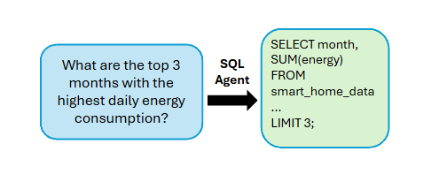

# Digital Bouncers

 

## Introduction

In The Great Acceleration: CIO Perspectives on Generative AI by MIT Tech Review and Databricks, Schaefer, Chief Health Informatics Officer at Kansas City VA Medical Center, emphasizes "trust" as key to adopting generative AI effectively. Healthcare exemplifies this, using AI for tasks like predicting protein structures, aiding drug discovery, tracking outbreaks, and assisting staff with chatbots. This broad applicability extends to smart home AI, where privacy is critical as users control their data. As homes generate more data, ensuring user control will be essential to building trust. Likewise, developers must safeguard AI integrity by moderating user interactions. Ethical AI implementation is crucial to protecting data, safety, and privacy for all affected.

 

### What are guardrails?

So what are guardrails? LLM guardrails are mechanisms that ensure large language models (LLMs) operate within safe, ethical, and intended boundaries. They help prevent harmful outputs, enforce compliance with policies, and guide model behavior. Guardrails can include content filtering, user intent detection, bias mitigation, security measures, and context constraints to improve reliability and safety in AI interactions.

 

## Our Data

Our dataset is ~500k row dataset which contains 1 year of energy readings by minute for appliances in a single household​. There is also a 2-page utility bill explanation document to provide context for bill explanation inquiries​. Additionally, we personally curated a test set comprised of 35 prompts for evaluating guardrail and chatbot accuracy​.

 ​

## Our Solution

Introducing Digital Bouncers – an LLM-powered assistant for smart homes, providing homeowners with a reliable chatbot to answer energy-related questions.

Our tool integrates guardrails into agentic workflows with dynamic cloud storage, ensuring secure AI interactions. These guardrails mitigate risks in LLM applications at the input, intermediary, and output levels. Below is a flowchart of the general structure of our app.

 

 

### Key Features

Text2SQL Pipeline - Uses LangChain agents to query datasets for questions that can be answered via SQL. Below we have an example prompt that wqould fall under the Text2SQL Pipeline.

 

 

Retrieval-Augmented Generation (RAG) Framework - Obviously, not all questions can be answered using SQL. As such, RAG handles general queries beyond SQL capabilities. RAG is used to ensure that our chatbot’s answers about utility bills or energy usage come from a trusted knowledge source by relying on reference texts.

Persistence Layer - Responsible for storing and managing data by previous requests. A graph-based, PostgreSQL-backed system for storing and retrieving conversation history in real-time, ensuring continuity across LLM API sessions for seamless follow-ups and contextual interactions.​ 

 

### Guardrails

Input Moderation – Filters out harmful, off-topic, or inappropriate prompts. For instance, our input guardrail would protect against prompts like "Do energy type pokemons exist?", while allowing prompts such as "Which part of the house consumed the most energy in August?". This input rail would also to check to ensure that the user is only asking one question (sort of a secondary function that we called one question guardrail).

Intermediary Guardrail – Directs queries to either the Text2SQL pipeline or the RAG framework. For instance, questions that could be answered using SQL such as "Which part of the house consumed the most energy in July?" would be directed to the SQL framework. Other more general questions such as "Give me some recommendation on refrigerators which consume less energy" would be directed to our RAG framework.

RAG Check – Ensures logical consistency in generated responses. This is just a general sanity check for the response outputted by the chatbot.

Output Moderation – Blocks or rewrites responses to align with predefined guidelines and performs syntax validation. 

 

## Results

Below we attach the results of our chat bot after testing both the general functionality as well as the testable guardrails.

 

 

 

Based on the results, we could see that chatbot assistant, while somewhat accurate, can still use a lot of work. Perhaps with future finetuning, we'll be able to boost our accuracy. In terms of our guardrails, we could see that they provide a decent level of protection and accuracy. In fact, for the more concrete objective parameters (such as one question only guardrail), we could see that the guardrail layers actually perform quite well. But for more subjective topical guardrails, we can see that our guardrails are having a little difficulty against that. In any case, our guardrails seem to work well for most general clear cut cases.

 

## Next Steps

For our next step, we would allow users to ask about real time data in addition to historical data​.

## Additional Links

If you want to check out our actual codebase, be sure to click this [link](https://github.com/pndang/digital-bouncers)
!

If you want to check out our report, be sure to click this [link](https://drive.google.com/file/d/184Eizk4GZ-BtX_uqyhru3VBHOeXnGwBw/view?usp=drive_link)
!
